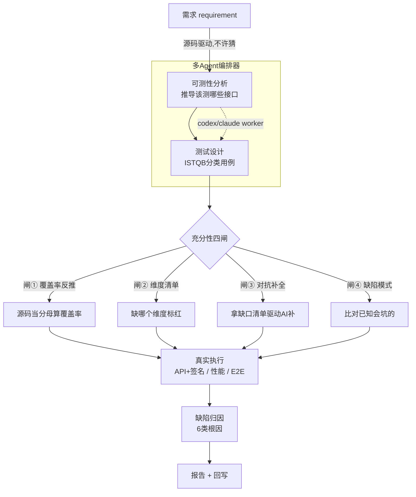

# AI Test Agent — 源码驱动的自动化测试智能体

> 把"需求 → 用例 → 执行 → 缺陷归因 → 报告 → 回写"做成一条**源码驱动、结果不伪造**的自动化流水线。

一个自研测试 Agent(约 3900 行 Python + 本机 LLM 生成节点),面向测试开发,把测试工作平台化。

> ⚠️ **说明**:本仓库是脱敏公开版。内网地址、企业标识、真实业务数据均已替换为占位符(如 `your-test-host.example.com`、`TARGET_SYSTEM`、`APP_ID_PLACEHOLDER`)。真实运行需替换为你自己的目标系统配置。

---

## 整体流水线



**一句话读懂**:给它一个需求 → 它自己读源码推导接口 → 设计用例 → **四道闸算出测得全不全(可度量)** → 真实执行 → 归因 → 出报告。全程本地、不出网。

---

## 能力一览

| 能力 | 说明 |
|---|---|
| **API 功能测试** | 读 YAML 用例 → 发真实 HTTP → 求值断言。支持网关签名协议(如 X5:MD5签名+信封+Base64+form)。 |
| **性能基线采样** | 同接口连发 N 次,统计 p50/p95/max。采样非压测。 |
| **缺陷自动发现归因** | 6 类根因(ENV/DATA/CASE/PRODUCT/TOOL/UNKNOWN),识别 HTTP 码与业务码不一致等设计问题。 |
| **Java 单测生成(白盒)** | 调本机 LLM(codex/GPT-5.5)读业务方法生成 JUnit5,真 AI 非模板。 |
| **E2E 业务链路** | 多个 API 步骤串成链路,步骤间上下文传递,任一步失败则中止。 |
| **报告 + 回写** | MD/HTML 报告 + 工单回写 payload(可配置发送)。 |
| **多项目 / CI** | `contracts/systems.yaml` 声明式多系统配置 + GitHub Actions。 |
| **多 Agent 编排器** | 把 claude/codex 当"员工":老板派任务、技能可插拔、任务依赖 DAG、并发、小队委派、定时触发。全本地不出网。 |
| **测试充分性四闸** | 把"够不够全"变成数字:覆盖率反推(源码当分母)+ 维度清单 + 对抗补全 + 缺陷模式比对。**AI 说测全了不算,机器算出来的才算。** |

**核心信条**:源码驱动(依据真实代码,不是 AI 拍脑袋)+ 结果不伪造(`blocked ≠ failed`,`dry-run ≠ 成功`)。

### 需求驱动 + 充分性(平台的两个高级特性)

```bash
python orchestrator/demo_requirement.py            # 给需求(不给接口),它自己推导该测什么
python tools/sufficiency/sufficiency_pipeline.py \  # 四道闸算充分性,给出覆盖率数字+缺口清单
    --spec api_spec.json --cases api_cases.yaml --patterns tools/sufficiency/defect_patterns.yaml
```

### 多 Agent 编排器(orchestrator/)

借鉴 [multica](https://github.com/multica-ai/multica) 的 agent 编排理念,但**纯本地自研、不依赖 Docker、不出网**(合规约束下的实现)。

| 抽象 | 说明 |
|---|---|
| Worker(员工) | 绑定 provider(codex/claude)+ runtime,统一 `run` 接口 |
| Task(任务) | 生命周期状态机 + 依赖 DAG(前置产出注入后续) |
| Skill(技能) | 声明式,加能力=加 skill 文件,不改核心,同事可维护 |
| Workspace(隔离) | 按项目隔离产物/配置 |
| Runtime(运行时) | local 已实现,remote 留接口 |
| Squad(小队) | 员工分组 + leader 委派,稳定路由 |
| Autopilot(定时) | cron/manual 触发自动生成任务 |

```bash
python orchestrator/demo_run.py       # V1:派活给员工执行技能
python orchestrator/demo_run_v2.py    # V2:DAG + 并发 + 小队 + 定时触发
```

---

## 架构

```
需求(issue)
   ↓ 扫源码建接口清单
生成用例(ISTQB 分类)
   ↓
真实执行(API+签名 / 性能 / E2E)
   ↓
缺陷自动归因(6 类根因)
   ↓
报告(MD/HTML) + 回写
```

一个 CLI 总调度(`cli/test_squad.py`),5 个工具各管一段:

| 工具 | 职责 |
|---|---|
| `tools/api-runner/api_execution_tool.py` | API 执行 + 签名 + 性能采样 |
| `tools/api-runner/e2e_execution_tool.py` | E2E 多步链路 |
| `tools/codegen/java_unit_test_generate.py` | LLM 生成 Java 单测 |
| `tools/artifact-collector/` | 产物收集 + 状态裁决 |
| `tools/defect-analyzer/` | 失败根因归因 |
| `tools/report-renderer/` | 报告渲染 + 回写 |

---

## 快速开始

```bash
pip install -r requirements.txt

# 配置目标系统(替换为你自己的)
export TARGET_SYSTEM_BASE_URL="https://your-test-host.example.com/api"
export TARGET_SYSTEM_APPKEY="<your-appkey>"

# 校验 workflow(无需网络)
python cli/test_squad.py mify validate --workflow mify/workflows/super_test_agent_v1.yaml

# 环境自检
python cli/test_squad.py doctor --profile demo

# 跑 API 用例
python cli/test_squad.py run-api --issue ISSUE-001

# 性能探针
python tools/api-runner/api_execution_tool.py --issue ISSUE-001 --perf --samples 15

# E2E 链路
python tools/api-runner/e2e_execution_tool.py --issue ISSUE-001

# 生成 Java 单测(需本机 codex CLI)
python tools/codegen/java_unit_test_generate.py --spec <spec.json> --out <Test.java>

# 出报告
python cli/test_squad.py report --issue ISSUE-001
```

---

## 设计借鉴

借鉴以下 AI 工程实践的**设计理念**(非代码):
- **Kiro**(spec-driven 工作流)→ "需求→任务→执行"流水线范式
- **VAF**(阶段门禁 + 人工确认)→ blocked 门禁、确认节点
- **VCB**(进程管控 + 调度)→ 巡检调度、工作区隔离思想

代码全部针对测试场景自研。

---

## 目录结构

```
cli/                 CLI 总调度
tools/
  api-runner/        API + E2E + 性能执行器
  codegen/           LLM 单测生成
  artifact-collector/  产物收集与状态裁决
  defect-analyzer/   缺陷归因
  report-renderer/   报告 + 回写
mify/                LLM 节点 prompt + workflow
contracts/           契约 + 多系统配置(systems.yaml)
resources/           代码风格 / UI 动作目录
.github/workflows/   CI
```

---

## License

MIT
