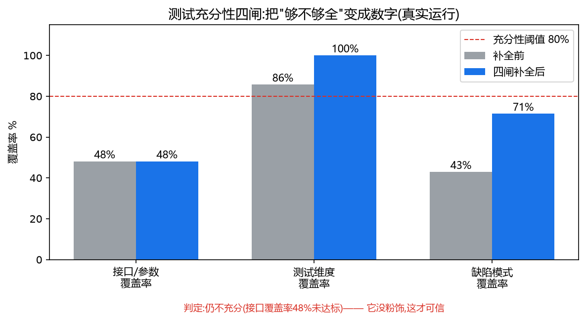

# AI 说它测全了?我用源码反推,四道闸让它无处遁形

> 这是整个专栏技术含金量最高的一篇。
> 前面我们让 AI 从需求设计出了看起来很专业的用例。这篇要回答一个要命的问题:**它到底测全了没?**
> 答案不是"感觉挺全",而是一个数字:**48.1%**——以及四道机器可验证的闸,怎么把这个数字算出来。

---

## 一、"充分性"是 AI 测试的死穴

AI 生成用例有个隐蔽的危险:**它总能生成"看起来合理"的用例,但你无法知道它漏了什么。**

- 它生成 4 条,你怎么知道不该是 10 条?
- 漏掉的 6 条,恰好是线上会炸的那 6 条呢?

而且这里有个坑:**你不能问 AI "你测全了吗"。** 研究表明,LLM 对自己的自评普遍高估 15-20%——它会自信地说"覆盖全面"。

VAF/VCB 的原则给了答案:**机器可验证,优于 AI 自述。** 用一个 AI 无法糊弄的外部机制,去算它到底测了多少。

但"全不全"是个模糊的词。要可度量,得先把"漏"拆开——**漏,其实有四种。**

---

## 二、四种"漏",四道闸

| 漏的类型 | 例子 | 对策 |
|---|---|---|
| 漏接口/参数/错误码 | 某接口根本没用例 | **闸① 覆盖率反推** |
| 漏测试维度 | 测了正向,忘了越权 | **闸② 维度清单** |
| 漏"想不到的" | 刁钻组合场景 | **闸③ 对抗补全** |
| 漏"已知会坑的" | 这类系统历史栽过的坑 | **闸④ 缺陷模式比对** |

一道闸只堵一种漏。四道叠起来,漏的概率才指数下降。下面逐个拆。

---

## 三、闸①:覆盖率反推——用源码当分母

核心思想:**被测系统的源码里,写着"应该测什么"的真相。**

Java 入参对象的校验注解就是分母:

```java
public class PullPriceX5Req {
    @NotBlank private String purchaseOrg;   // 必填 → 该有"缺失"用例
    @NotBlank private String objectCode;    // 必填
    @NotBlank private String vendorCode;    // 必填
    @NotBlank
    @EnumRange(strValues = {"MVAFee","sampleFee","...","COST"})  // 7个枚举值
    private String priceType;
}
```

抽成分母清单,拿 AI 生成的用例去比对:

```python
def gate1_coverage(spec, cases):
    text = json.dumps(cases, ensure_ascii=False)
    api_missing = [a for a in spec["apis"] if a not in text]        # 漏了哪些接口
    ec_missing  = [e for e in spec["error_codes"] if str(e) not in text]  # 漏了哪些错误码
    # 枚举覆盖、必填缺失用例覆盖 ...
    # 加权:接口40% 参数30% 枚举20% 错误码10%
    return overall_pct, gaps
```

真实结果:




```
[闸①覆盖率] 48.1%
[缺口] 缺接口: pullPrice, getQty(只测了getPrice)
       缺错误码: 401鉴权, 3007未找到
```

**48.1%。** 这个数字,是这套系统的灵魂——它把"够不够全"从一句感觉,变成了可对外证明的事实。

---

## 四、闸②:维度清单——防维度盲区

覆盖率反推能抓"漏接口",但抓不到"漏维度"(比如接口都测了,但都只测正向)。闸②用一张固定的维度清单扫:

```python
DIMENSION_CHECKLIST = {
    "positive": "正向", "missing": "参数缺失", "boundary": "边界值",
    "enum_invalid": "枚举非法", "auth": "鉴权",
    "not_found": "数据不存在", "type_error": "类型错误",
}
# 从每条用例的关键词判断它覆盖了哪些维度,缺的标红
```

真实结果:维度覆盖 85.7%,缺"枚举非法值"维度。

---

## 五、闸③:对抗补全——拿缺口清单指挥 AI 补

前两道闸算出了缺口。闸③的关键设计:**不是让 AI "再想想"(那还是它自己),而是拿机器算出的确切缺口去指挥它补。**

```python
def build_gap_prompt(report, spec):
    gaps = report["gaps_summary"]
    return (f"覆盖率分析发现的确切缺口,只补这些:\n"
            f"缺接口: {gaps['缺接口用例']}\n"
            f"缺错误码: {gaps['缺错误码用例']}\n"
            f"缺维度: {gaps['缺测试维度']}\n"
            "生成对应用例,只输出YAML")
```

AI 补完后,**再跑一遍覆盖率复算**——形成闭环。真实结果:补 2 条后,维度 85.7% → 100%。

---

## 六、闸④:缺陷模式比对——让平台记住"踩过的坑"

前三闸解决"结构上全不全",闸④解决"经验上有没有踩过的坑"。我建了个缺陷模式库,含通用模式 + **本项目真实踩过的坑**:

```yaml
- id: DP001
  source: "本项目真实发现"
  name: "HTTP状态码与业务码不一致"
  desc: "参数错误时HTTP=200但业务码=400,只看HTTP码的监控会漏报"
  severity: high
- id: DP002
  source: "本项目真实发现(RPA经验迁移)"
  name: "假成功:错误提示被当成功"
  severity: high
```

用例集比对一遍,真实结果:缺陷模式覆盖 42.9% → 补全后 71.4%,**仍报"假成功"高危模式未覆盖**。

这一步的价值:**把散落在老工程师脑子里的"踩坑记忆",变成平台能自动检查的资产。** 这也是 VAF/VCB 讲的 "skill 复用"——每个踩过的坑,变成全队受益的检查项。

---

## 七、四闸串成流水线,和它最诚实的一面

```
[初测]       覆盖率48.1% | 维度85.7% | 判定"不充分"
[闸③补全]    拿缺口清单驱动AI补2条 → 维度→100%
[闸④模式]    71.4% | 高危漏测:"假成功"未覆盖
[最终]       覆盖率48.1% | 维度100% | 缺陷模式71.4% | 判定"仍不充分"
```

注意最后一行——**流水线判定"仍不充分",覆盖率还是 48.1%。它没给我一个漂亮的 100%。**

**这恰恰是我最得意的地方:它诚实。** 一个想讨好你的 AI 会说"已优化完成";而这套机器算出的闸,会冷冰冰地告诉你"还差 pullPrice/getQty 接口、401/3007 错误码、假成功模式"。**它不粉饰,因为它是机器,不是想让你满意的 AI。**

---

## 八、这套东西,为什么是护城河

普通"AI测试" vs 有这套闸的平台:

| | 普通AI测试 | 本平台 |
|---|---|---|
| 生成用例后 | "搞定了" | "覆盖率48%,漏了这5项" |
| 充分性 | AI说了算(不可信) | 机器算出的数字 |
| 定位 | AI辅助 | 可度量的测试设计质量保障 |

**从"我让AI写了测试"升级到"我能证明测试测得全不全"——这是碾压性的区别,也是 AI 时代测试开发真正的壁垒。**

---

## 九、复现

```bash
python tools/sufficiency/coverage_analyzer.py --spec api_spec.json --cases api_cases.yaml
python tools/sufficiency/sufficiency_pipeline.py --spec api_spec.json \
    --cases api_cases.yaml --patterns defect_patterns.yaml
```

把 `api_spec.json` 换成你系统的接口分母,就能算你的 AI 用例测了几成。**我赌你第一次跑,数字不会好看。** 但那个不好看的数字,比"看着挺全"的用例值钱得多。

---

## 十、诚实边界

- 覆盖率算法目前是"关键词匹配"级(判断用例是否涉及某接口/参数),不是 AST 级精确解析——V2 可升级为解析用例结构精确匹配。
- 缺陷模式库目前 7 条(2 条本项目真实 + 5 条通用),持续积累。
- 48% 没到 80% 阈值,是因为演示只补了 2 条;继续补 pullPrice/getQty 用例即可达标,机制是通的。

---

> **一句话**:AI 能生成测试,但不能保证测得全。保证充分性的,永远是你构建的验证系统——这套闸,才是 AI 时代测试开发真正的护城河。

*(下一篇:能生成 ≠ 能落地。AI 测试的最后一公里。)*
