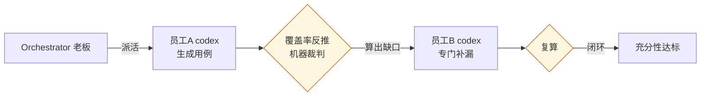

# 从"一个 AI"到"一支 AI 测试团队":多 Agent 的分工与制衡

> 前面几篇解决了"怎么让单个 AI 测得可信"。这篇往上走一层:
> **单个 AI 再强也靠不住(会漏、会撒谎)——那怎么办?**
> 答案不是找一个更强的 AI,而是像组建团队一样组织多个 AI:分工、制衡、互相 review。
> 这是从"用 AI 工具"到"管 AI 团队"的组织范式转变。

---

## 一、单个 AI 的天花板

前面的专栏我们一直在给单个 AI 装"验证机制"(充分性四闸、归因引擎)。但有个根本限制:

> 无论机制多好,**用例的第一版还是一个 AI 生成的**——它有它的盲区,它想不到的,机制能算出"漏了"但补的还是它自己。

这就像一个团队只有一个人:再优秀,也有他看不见的角度。人类团队怎么解决?**分工 + 互相 review。** 一个人写,另一个人挑毛病。

AI 也一样。**解法不是"找一个更聪明的 AI",而是"组织多个 AI 分工制衡"。** 这正是小米 multica 这类平台的思路——把 coding agent 当团队成员,分配任务、追踪、协作。VCB 也有一条原则:**控制面必须随 agent 能力演进**——当 agent 能协作、能反向调用,你的编排系统就得管得住这种协作。

---

## 二、约束下的选择:为什么自研

我本想直接用 multica。但撞上两个硬约束:

- **公司不让装 Docker**(multica 自托管要 Docker)
- **数据不能出网**(multica 连云要把任务发到外部)

这两条都是红线。于是我做了个决定:**借鉴 multica 的理念,自研一个纯本地的轻量编排器。**

这里有个态度问题值得说:**借鉴理念 ≠ 抄代码。** 我借的是它的抽象设计(Worker/Task/Skill/Squad),代码是自己写的、针对测试场景、纯本地跑。约束不是障碍,反而逼出了更合规、更可迁移的方案。

---

## 三、把 AI 组织成"团队":核心抽象

编排器的核心,是把"AI 协作"抽象成几个概念(借鉴 multica):

```python
Worker    # 员工:绑定一个 provider(codex/claude),统一 run 接口
Task      # 任务:有生命周期(enqueued→running→done),可声明依赖
Skill     # 技能:能力可插拔,加功能=加一个skill,不改核心
Squad     # 小队:员工分组,leader 委派
Workspace # 工作区:按项目隔离
```

**关键设计:能力做成可插拔的 Skill。** 加一个新测试能力,就是注册一个 Skill,不用改核心代码——同事也能维护。这正是 multica "compound skills"(技能复用)的思路。

---

## 四、分工与制衡:一个写,一个挑漏

最能体现"团队"价值的,是**制衡**。回到第 3 篇的充分性四闸——闸③对抗补全,本质就是两个 agent 的分工:

```
codex(员工A):生成用例
    ↓ 覆盖率反推(机器审查,算出缺口)
codex(员工B):拿着缺口清单专门补漏
    ↓ 再复算
```

一个负责"写",一个负责"补漏",中间用机器算的覆盖率当"裁判"。**这比单个 AI 自己写自己检查,可靠得多**——因为制衡的核心是"用不同的角色相互约束",而不是让同一个角色自我监督。



---

## 五、真实跑通:任务依赖 DAG

"团队协作"不是喊口号,得有真实的任务编排。编排器支持 DAG 依赖——前一个任务的产出,自动喂给后一个:

```python
orch.submit(Task(id="REQ-ANALYZE", skill="analyze_requirement"))
orch.submit(Task(id="REQ-DESIGN",  skill="design_test",
                 depends_on=["REQ-ANALYZE"]))   # 依赖分析结果
orch.run()   # DAG拓扑执行:分析完,产出自动注入设计任务
```

真实运行:

```
[orch] 派活: REQ-ANALYZE → codex-1
[orch] 完成: REQ-ANALYZE (43s) → 产出注入下游
[orch] 派活: REQ-DESIGN → codex-1(拿到上游分析结果)
[orch] 完成: REQ-DESIGN (63s)
```

需求分析的产出,真实地流进了测试设计——**这就是"团队接力"在跑通。**

---

## 六、还有一道硬约束:防止 AI 团队失控

多 agent 协作带来一个新风险:**agent 之间可能形成死循环**(A 触发 B,B 又触发 A)。VCB 专门做了循环检测(REPEAT/PINGPONG/BURST 三种模式熔断)。

我的编排器目前用了一道更朴素的硬约束——**DAG 成环检测**:

```python
ready = [t for t in pending if all(dep in done_ids for dep in t.depends_on)]
if not ready:   # 没有可执行的任务 = 依赖成环
    for t in pending:
        t.status = BLOCKED   # 物理阻断,防死循环
```

**硬约束优于软约束**(VAF原则1):不是提示 AI "别循环",而是机制上让它循环不起来。

---

## 七、复现

```bash
python orchestrator/demo_requirement.py   # 需求分析→设计 DAG 协作
python orchestrator/demo_run_v2.py        # DAG+并发+小队委派
```

编排器在 `orchestrator/`,7 个抽象都在 `core.py`。

---

## 八、诚实边界

- 我实现了任务级的 DAG 成环检测(硬约束);VCB 的 MCP 循环检测(REPEAT/PINGPONG/BURST 语义级)更进一步,是我的下一步。
- Squad 委派、Runtime 远程执行目前是接口占位,V2 逐步补实现。
- 目前主要用 codex;claude worker 待登录后可加入,形成真正的"多 provider 团队"。

---

> **一句话**:单个 AI 有盲区,解法是组织多个 AI 分工制衡——一个写、一个挑漏、机器当裁判。这是从"用 AI"到"管 AI 团队"的组织范式,也是应对"AI 不可靠"的终极思路:不靠更强的个体,靠更好的组织。

*(下一篇,收官:测试可靠性工程——AI 时代的第三代测试范式。)*
