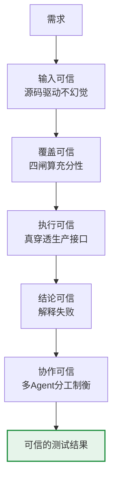

# 收官:测试可靠性工程——AI 时代的第三代测试范式

> 我们花了 20 年,让测试从"人工"走到"自动化"。
> 现在,当测试本身开始由 AI 完成,一个新问题浮现:**如何保证"自动生成测试的 AI"是可信的?**
> 这一路(需求理解 → 充分性 → 落地 → 归因 → AI 团队),就是在回答这个问题。这篇,我想把它收束成一个框架。

---

## 一、测试的三代范式

回头看测试工程的演进,其实是三代:

| 代际 | 形态 | 解决的核心问题 |
|---|---|---|
| **第一代** | 人工测试 | 有没有测 |
| **第二代** | 自动化脚本 | 测得快不快、能不能回归 |
| **第三代** | **AI 驱动 + 可靠性工程** | **AI 测的,可不可信** |

第一代、第二代都在解决**效率**问题。而第三代面对的是一个全新的问题:**当"设计测试、执行测试、判断结果"都交给 AI,你凭什么相信它的结论?**

这不是"效率"问题,是"信任"问题。**而信任,不能靠 AI 更聪明来给,只能靠工程来建。**

---

## 二、一个贯穿全专栏的元原则

整个专栏,其实只在论证一句话(来自小米 VAF/VCB 的提炼):

> **AI 能力由模型决定,AI 可靠性由你构建的控制系统决定。**

模型越来越强,能力会自动涨。但"会不会漏、会不会撒谎、能不能落地、失败了能不能解释"——这些**可靠性**问题,模型不会自动解决,得靠你的系统设计。

开篇我抛了个悖论:**测试的灵魂是"不信任",却把它交给了最不该信任的 AI。** 现在可以回答了:

> **你不需要信任 AI。你需要构建一套让 AI 无法蒙混过关的系统。**

这套系统,就是"测试可靠性工程"。

---

## 三、这一路,是怎么一步步建立信任的

回看整个专栏,每一篇都在解决"信任"的一个环节:

```
需求理解(1-2篇)  → 让AI从需求读懂该测什么,源码驱动不幻觉    [输入可信]
充分性(3篇)      → 用源码反推覆盖率,四道闸算出漏了什么      [覆盖可信]
落地(4篇)        → 真穿透生产接口,不是mock                 [执行可信]
归因(5篇)        → 解释失败,不只报失败                     [结论可信]
AI团队(6篇)      → 多agent分工制衡,一个写一个挑漏          [协作可信]
```

**每一环都不靠"相信 AI",而靠一个可验证的机制。** 五环叠起来,才构成对"AI 测试结果"的整体信任。



---

## 四、诚实复盘:VAF/VCB 八原则,我实证了几条

我全程拿 VAF/VCB 的"AI 控制工程化八原则"当参照系。诚实对照一下——**哪些我真做到了,哪些还没**:

| 原则 | 我的实证 | 程度 |
|---|---|---|
| ① 硬约束优于软约束 | DAG 成环检测物理阻断 | ✅ 部分 |
| ② Fail-safe 默认值 | blocked≠failed,dry-run 不伪装成功 | ✅ 强 |
| ③ 机器可验证优于AI自述 | 覆盖率反推、断言引擎 | ✅ 强 |
| ④ 分层控制 | 需求→设计→执行分层 | ✅ 部分 |
| ⑤ 状态持久化 | task 状态机、workspace | 🔶 雏形 |
| ⑥ 反幻觉需要机制 | 源码驱动生成,不许猜 | ✅ 中 |
| ⑦ 失败分类 | 6 类根因归因 | ✅ 强 |
| ⑧ 防御反向调用 | (编排器暂未涉及 MCP 回调) | ❌ 未做 |

**强命中 ②③⑦,部分 ①④⑥,雏形 ⑤,未做 ⑧。**

我不打算把这张表填满来显得"完整"。**恰恰相反——承认⑤只是雏形、⑧还没做,是这套方法论最该有的样子。** 因为可靠性工程的第一课就是:**不粉饰、只信可验证的**。一份声称"八条全做到"的复盘,本身就违背了它宣称的原则。

---

## 五、给同行:如果你也想做

如果你也想在 AI 时代做测试平台,我趟过的路给你三条:

1. **起点定在需求,不是接口。** 从接口出发只是工具;从需求出发才是平台。
2. **充分性必须可度量。** 别信 AI "我测全了",拿源码反推一个数字出来。这是护城河。
3. **不靠更强的 AI,靠更好的验证。** 你的价值不在"用了 AI",在"构建了让 AI 可信的系统"。

---

## 六、复现:一条命令看全貌

```bash
# 需求→设计→执行→充分性→归因→报告,全链路
python orchestrator/demo_requirement.py          # 需求驱动
python tools/sufficiency/sufficiency_pipeline.py # 充分性四闸
python cli/test_squad.py report --issue ISSUE-001 # 执行+归因+报告
```

全部代码在 [GitHub](https://github.com/xingzaidadi/test-reliability-agent)(脱敏版),约 3900 行 Python + 编排器 + 充分性模块。

---

## 七、最后一句

我们让测试自动化,花了二十年。让"自动生成测试的 AI"变得可信,才刚刚开始。

> **第三代测试的核心竞争力,不是"你会不会用 AI",而是"你能不能让 AI 测出来的结果,值得信任"。** 而这,是工程问题,不是模型问题——也正是 AI 时代,测试工程师真正的、无法被替代的价值所在。

*(全专栏完。感谢读到这里。代码开源,欢迎拍砖。)*
