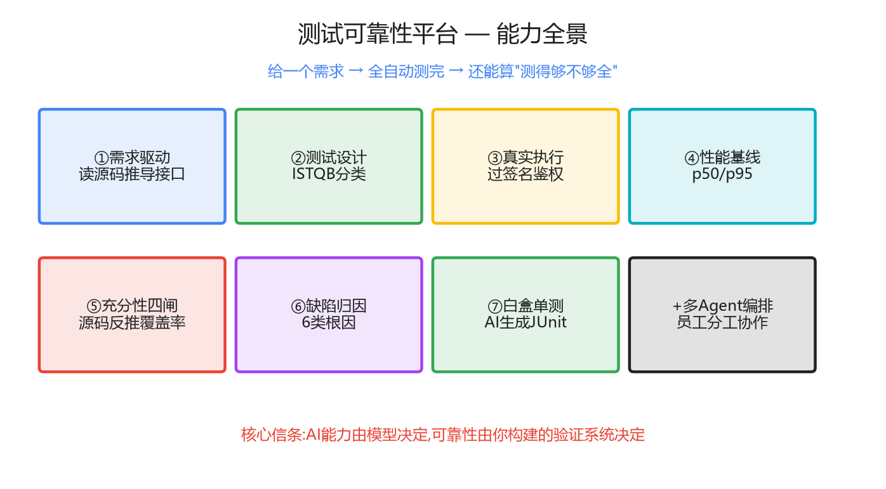

# AI 说它测完了,我一查只测了 48%——一个测试可靠性平台的诞生

> 这是一个系列的开篇。我不打算上来就讲架构、列功能——那太无聊。
> 我先给你看一个把我整不会了的瞬间,然后你自然就懂这个平台是干嘛的。
> 代码全开源:https://github.com/xingzaidadi/test-reliability-agent

---

## 一、那个让我后背发凉的瞬间

事情是这样的。

我让 AI 给一个接口生成测试用例。它很快给了我 4 条,分类清楚、断言完整、看起来特别专业。搁以前,我扫一眼"嗯挺全",就提交了。

但那天我多问了自己一句:**我凭什么相信它没漏?**

它说生成了 4 条。可万一该有 10 条呢?那漏掉的 6 条——**万一恰好是线上会炸的那 6 条呢?**

我于是写了个小程序,拿这个系统的**源码**去反推:这接口一共几个必填参数、几个枚举值、几个错误码,一份"及格的用例"到底该覆盖多少。程序跑完,吐出一个数字:

> **覆盖率 48.1%。漏了另外两个接口、两类错误码、所有枚举非法值。**

那一刻我意识到一件事,也是这整个系列想讲的一件事:

> **AI 生成的测试,最危险的不是"跑不起来",而是它跑起来了、看着挺全、让你以为测过了。它给你一种"虚假的安全感"。**

而测试这个工种的灵魂,恰恰是"不轻信、要验证"。我们却把它交给了一个最会一本正经胡说八道的东西——**这就是 AI 测试的根本悖论:让一个"要求不信任"的工种,依赖一个"最不该被无条件信任"的执行者。**

我后来想通了破局点,也贯穿这整个系列:

> **你不需要让 AI 变得可信,你需要构建一套"让 AI 无法蒙混过关"的机制。**

这个平台,就是我为了解决这个悖论做出来的。

---

## 二、它到底能干什么(用一个真实场景讲)

别看功能列表,看它怎么陪我走完一次真实的测试。

**我给它的,不是接口文档,是一句需求:**
> "某后端系统要支持按费用类型查询采购价格。"

我故意没告诉它测哪个接口。然后它开始干活:

**第 1 步,它自己去读源码,找到了该测的接口。** 我一句接口名没提,它从需求 + 源码里推导出:该测 `queryPrice` 和 `fetchPrice`。它甚至主动提醒我:"'有效价格'的判定规则和性能要求没有量化标准,建议先跟需求方确认"——这句话,是资深测试才会说的。

**第 2 步,它按 ISTQB 分类设计了用例。** 正向、参数缺失、枚举非法、鉴权……还想到了一条我没料到的:"queryPrice 和 fetchPrice 在相同条件下结果应该一致"——这种跨接口用例,只盯单个接口是想不到的。

**第 3 步,它真的把请求发出去了。** 这个系统用的是某企业级网关签名协议,不是裸 HTTP。我一开始怎么发都是 500,后来还原出签名算法(签名+信封+编码),内置进执行器——请求真的穿透进去了,3 条正向用例全过,顺手还量了性能:p50=78ms,p95=104ms。

**第 4 步,就是开头那一幕:它算出覆盖率 48%,告诉我还漏了什么。** 不是"搞定了",而是"你只测了这么多,这几项没覆盖"。

**第 5 步,有一条用例挂了,它没只报个 FAIL。** 它分析:"HTTP 返回 200,但业务码是 400——传输层说成功、业务层说失败,这种不一致只看 HTTP 码的监控会漏报,归类为疑似产品 bug,建议 @ 开发。"它说清了"谁的锅、为什么、怎么办"。

**最后,出报告。** 而且整条链路——从需求到报告——是一条命令跑完的:

```bash
python pipeline.py --issue ISSUE-001
```

---

## 三、八项能力,一张图

上面那个场景,拆开就是这个平台的八项能力(全都真跑通过,不是 PPT):



| 能力 | 一句话 | 真实证据 |
|---|---|---|
| **需求驱动** | 给需求,它自己读源码找该测什么 | 从需求推导出 queryPrice/fetchPrice |
| **测试设计** | 按 ISTQB 分类设计用例 | 含跨接口一致性用例 |
| **真实执行** | 真发 HTTP,过企业签名鉴权 | 3/3,还原 网关签名 |
| **性能基线** | 顺手量 p50/p95 | 78ms / 104ms |
| **充分性四闸** | 源码反推覆盖率,算够不够全 | 48% + 缺口清单 |
| **缺陷归因** | 失败分 6 类根因,说清谁的锅 | 抓到 HTTP/业务码不一致 |
| **白盒单测** | 读 Java 代码生成能跑的 JUnit | 编译运行 6/6 |
| **多 Agent 编排** | claude/codex 当员工分工协作 | 一个写、一个补漏 |

---

## 四、它和你见过的"AI 测试"哪不一样

市面上的 AI 测试,90% 是这个套路:**你喂接口 → AI 吐用例 → 完事**。全不全?不知道,反正生成了。

这个平台的三个不同,恰恰是我认为"AI 测试该有的样子":

1. **起点是需求,不是接口。** 从接口出发,你只是个用例生成器;从需求出发、自己读代码找该测什么,才是平台。
2. **充分性是算出来的,不是感觉出来的。** 我不问 AI"你测全了吗"(它永远说测全了),我拿源码当分母反推——48% 就是 48%。
3. **结果不伪造。** 没配好环境标 blocked,不冒充 passed;覆盖率 48% 就写 48%,不粉饰成 100%。

一句话信条,也是这个系列反复在说的:

> **AI 能力由模型决定,AI 可靠性由你构建的验证系统决定。**

模型会越来越强,但"它会不会漏、会不会撒谎、失败了能不能解释清楚"——这些不归模型管,归你的工程设计管。

---

## 五、往下读

这个系列后面每篇深挖一项:怎么还原签名让请求穿透、四道闸怎么算覆盖率、AI 怎么读代码生成单测、多个 AI 怎么分工制衡……每篇都有真代码、真数据、能复现。

但如果你只想记住一件事,就记这个:

> **别再问"AI 能不能帮我写测试"了。该问的是:"AI 写的测试,凭什么值得我信任?"** 这个平台,就是我对这个问题的回答。

---

## 诚实边界(先说清,免得你觉得我吹)

- **UI 测试**没在这个系统跑通(它是纯后端无 UI);浏览器自动化的真经验在我另一个 RPA 项目里。
- 这是**真原型**,不是生产级产品——每项都真跑过,但离"同事拿去开箱即用"还有降门槛的活要干。
- 覆盖率目前是关键词匹配级,精确解析是下一步。

**不吹没做的,只讲真做过的。** 这本身,就是"测试可靠性"该有的态度。
